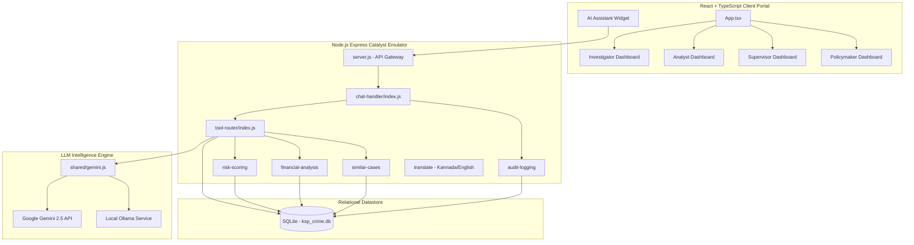

# 🛡️ Karnataka State Police (KSP) — Crime Intelligence & Analytics Portal

[]()
[]()
[]()
[-navy.svg?style=for-the-badge)]()
[-purple.svg?style=for-the-badge)]()

An advanced, multi-role tactical intelligence and conversational analytics portal built to empower the **Karnataka State Police (KSP) Crime Intelligence & Analytics Division**. The portal integrates spatial mapping, syndicate networks, recidivism risk assessment, and financial tracking with a state-of-the-art dual-mode AI assistant that runs either on the **Google Gemini Cloud API** or **100% locally and offline** using **Ollama (Llama3/Gemma2)**.

---

## 🏛️ System Architecture



---

## 🌟 Core Features

### 1. Multi-Role Tactical Dashboards
* **SI (Investigator) Portal**: Integrated Secure Query Terminal side-by-side with a detailed **Case Brief** viewer showing suspect profiles, modus operandi, matching cases, and money-flow trails.
* **DA (Analyst) Portal**: Provides district-level analytics, geo-spatial Leaflet maps, vis-network syndicate association graphs, and predictive ран-early warnings.
* **ACP (Supervisor) Portal**: Full accountability panel rendering a real-time system audit log with **data classification badges** and live microservice health checkers (Datastore, Zia ML).
* **DGP (Policymaker) Executive Brief**: High-density macro metrics showing state-wide crime rate distributions, socio-economic correlations, and seasonal crime forecasting.

### 2. Dual-Mode Conversational AI Engine
* **Cloud Mode (Google Gemini)**: Leverages Gemini 2.5 Flash for advanced structured query routing and context-aware narrative generation.
* **Offline Mode (Ollama)**: Direct integration with locally running models (e.g. `gemma2:2b`, `llama3:8b`) via local HTTP endpoints. **100% free, private, and offline**.
* **Automatic Fallback**: If the cloud API key is unconfigured or credits are depleted, the portal automatically falls back to local database query patterns and mock narratives without interrupting the user.

### 3. Rich Interactive Visualizations
* **Geographical Hotspot Map**: Dynamic Leaflet maps rendering incident clusters, district boundaries, and local police station jurisdictions.
* **Force-Directed Syndicate Graph**: Double-clickable Vis-Network graphs mapping connections between repeat offenders, shared case links, and modus operandi matches.
* **Financial Money Trail**: Interactive transaction graph highlighting suspicious bank accounts, money flow volumes, and hawala nodes in high-contrast red.
* **Socio-Demographic Dashboard**: Deep-dive analytics on age distribution, gender splits, education levels, and unemployment rates correlated with crime rates.

### 4. Localized Accessibility
* **Voice STT/TTS**: Native Web Speech API integration. Dictate queries via microphone in real-time, or listen to the AI narrative summaries.
* **Kannada Language Support**: Dynamic dual-translation API converting Kannada queries to English for internal processing, and translating the intelligence briefings back to Kannada text and speech.

---

## 🛠️ Tech Stack

| Layer | Technologies Used |
| :--- | :--- |
| **Frontend** | React 19, TypeScript, Tailwind CSS v4, Lucide Icons |
| **Visualizations** | Leaflet (Maps), vis-network (Force-graphs), Recharts (Stats) |
| **Backend** | Node.js, Express, dotenv |
| **Database** | SQLite3 (simulating Zoho Catalyst Relational Datastore) |
| **Speech** | Web Speech API (Speech-to-Text & Text-to-Speech) |
| **Local LLM** | Ollama API (Llama3/Gemma2) |
| **Cloud LLM** | Google Gemini 2.5 Flash API |

---

## 🚀 Getting Started

### 1. Prerequisites
Ensure you have **Node.js** (v18+) and **Python 3** installed on your machine.

### 2. Installation
Install dependencies for the root repository, frontend, and backend with a single command:
```bash
npm run install-all
```

### 3. Initialize & Seed Database
Build the schema and seed the database with realistic synthetic case reports, suspect linkages, financial transactions, and early warning predictions across Karnataka districts:
```bash
npm run seed
```

### 4. Environment Configuration (`.env`)
Create a `.env` file in the root workspace. You can choose to run the cloud Gemini LLM or the local Ollama LLM:

#### To Run with Local Ollama (Free & Offline):
Make sure Ollama is running (`ollama run gemma2:2b`) and configure:
```env
USE_OLLAMA=true
OLLAMA_MODEL=gemma2:2b
```

#### To Run with Google Gemini (Cloud API):
Generate a key from [Google AI Studio](https://aistudio.google.com/) and configure:
```env
USE_OLLAMA=false
GEMINI_API_KEY=AIzaSyYourGeminiApiKeyHere
```

### 5. Running the Application
Start the frontend client (Vite on port `5173`) and the backend Express server (port `3001`) concurrently:
```bash
npm run dev
```
Open **[http://localhost:5173/](http://localhost:5173/)** in your browser.

---

## 🔍 Example Queries to Run in Chat

The conversational AI automatically parses natural language queries and renders the correct interactive widget inside your chat logs. Try entering these:

| Objective | Query Example | Spawned Widget |
| :--- | :--- | :--- |
| **Geographic Hotspots** | *"Where are cyber crime incidents in Bengaluru City?"* | **Interactive Leaflet Map** |
| **Syndicate Links** | *"Show repeat offender connection networks"* | **vis-network Force Graph** |
| **Recidivism Risk** | *"What is the threat score of Jagadish alias 'Jacky'?"* | **AutoML Risk Scorecard** |
| **Financial Trails** | *"Trace the money flow for case FIR-2026-001"* | **Financial Transaction Graph** |
| **State Crime Trends** | *"Plot theft trends in Mysuru vs Mangaluru"* | **Recharts Timeline Chart** |
| **Demographic Insights** | *"Show socio-demographic correlation analysis"* | **Socio-Demographic Panel** |
| **Case Pattern Match** | *"Find similar cases to FIR-2026-003"* | **Similar Case Match Card** |
| **Proactive Forecasting** | *"Predict upcoming crime hotspots"* | **Forecast Alert Panel** |

---

## 🔒 Security & Accountability
The portal is designed in compliance with law enforcement security standards:
* **Data Classification**: All data responses are tagged with data classification badges (e.g. `Confidential`, `Restricted`, `Highly Sensitive`).
* **Audit Trails**: Every conversational query, translated text, and database download is logged in a secure, immutable audit table containing timestamps, badge IDs, and IP addresses.
* **Official Banner**: A persistent warning header: `Restricted — For Official Use Only • Karnataka State Police` is rendered on every viewport.
